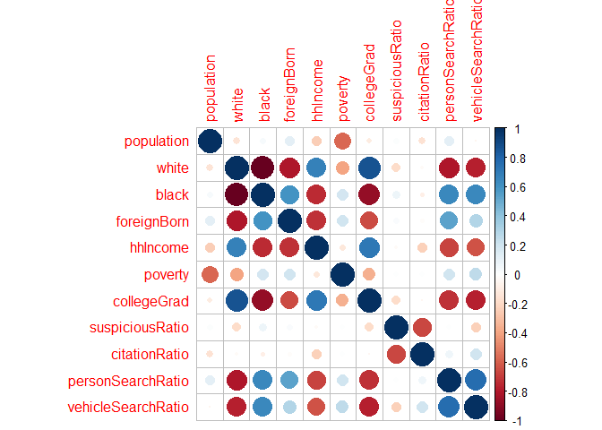
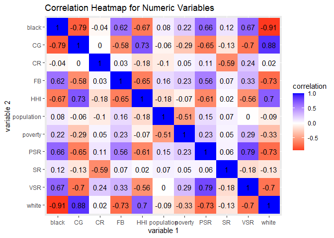
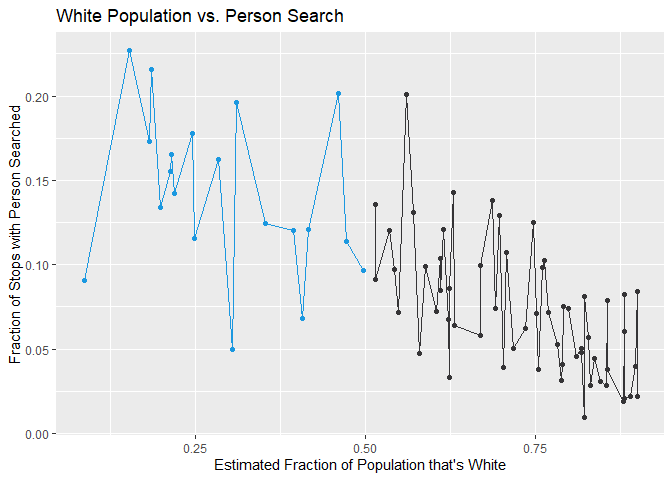
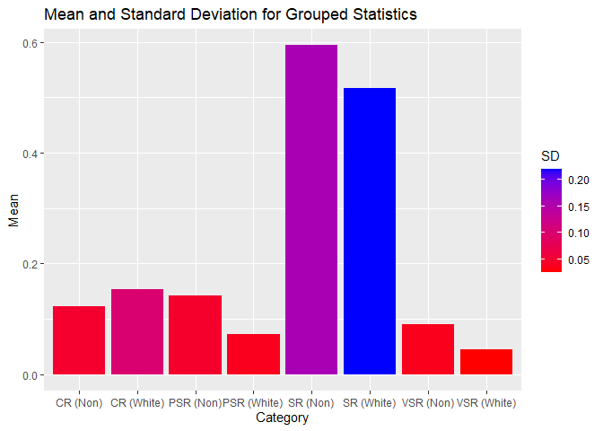
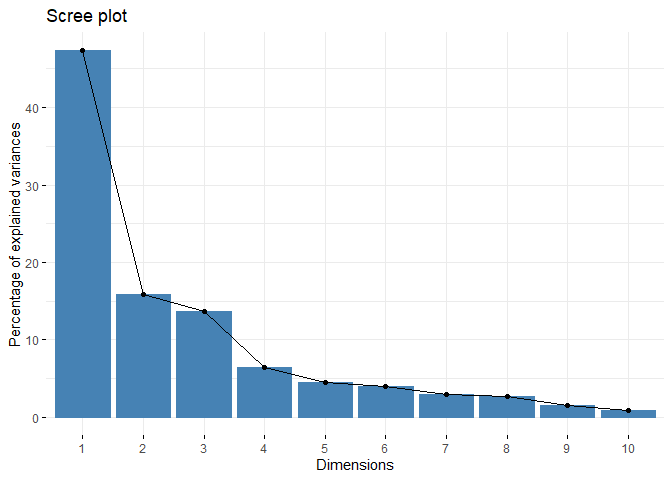
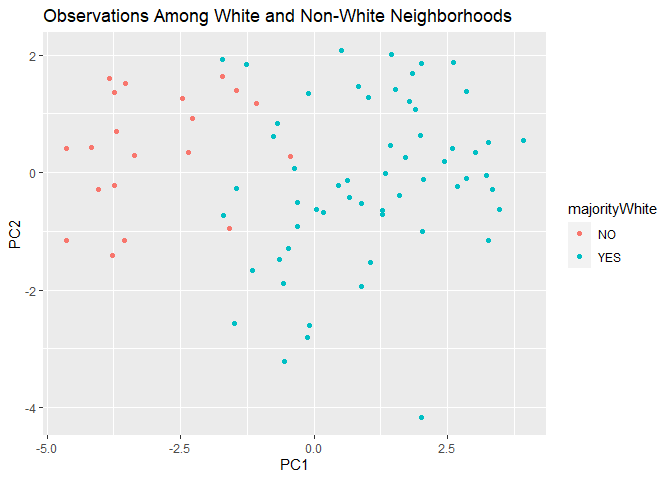
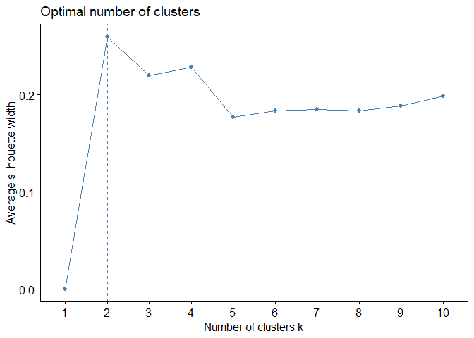
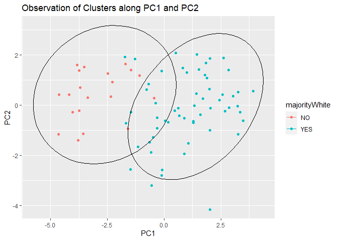

Project 1 - Analyzing Relationships Between Minneapolis Demographics and
Stop Data
================

## Truman Le ttl662

------------------------------------------------------------------------

### Introduction

For this project, I chose the datasets MplsDemo (Minneapolis Demographic
Data 2015, by Neighborhood) and MplsStops (Minneapolis Police Department
2017 Stop Data) provided by the carData package in R. I used all eight
variables from MplsDemo, which includes ‘neighborhood’ (name of the
neighborhood), ‘population’ (total population), ‘black’ (fraction of the
population estimated to be black), ‘white’ (fraction of the population
estimated to be white), ‘foreignBorn’ (fraction of the population
estimated to be foreign born), ‘hhIncome’ (estimated median household
income), ‘poverty’ (estimated fraction earning less than twice the
poverty level), and ‘collegeGrad’ (estimated fraction with a college
degree). From MplsStops, I only used 5 of the variables in MplsStops,
which are ‘neighborhood’ (same as MplsDemo), ‘problem’ (a factor with
levels ‘suspicious’ for suspicious vehicle or person stops and ‘traffic’
for traffic stops), ‘citationIssued’ (a factor with levels ‘no’ ‘yes’
indicating if a citation was issued), ‘personSearch’ (a factor with
levels ‘no’ ‘yes’ indicating if the stopped person was searched), and
‘vehicleSearch’ (a factor with levels no or yes indicating if a vehicle
was searched). The four variables that aren’t neighborhood were tidied
to be numeric, I transformed them into ratios with ‘suspiciousRatio’
(the proportion of suspicious vehicle/person stops out of all the
vehicle/person stops), and ‘citationRatio’, ‘personSearchRatio’, and
‘vehicleSearchRatio’ (the proportion of getting a citation, person
searched, or vehicle searched out of all the traffic stops). All NA
values were omitted to guarantee complete data

This is interesting to me because I’ve always researched about
discrimination in society, whether that be incarceration rates or the
education system, and there’s been a lot of growing news over the last
few years on discrimination in police stops. This is an opportunity for
me to do the analysis myself and see if there is discrimination in
Minneapolis police stops in 2017. I expect to see an association with
the fraction of population estimated to be white and one of the ratios
of either suspicion, citation issued, person searched, or vehicle
searched.

Also as a note, ratio is an incorrect word to describe the numeric
values created, the correct word should be proportion, but I only
realized this long after all of my data was created and modified with
the term ‘ratio’.

### Tidy

``` r
library(carData)
library(dplyr)
library(tidyverse)
data(MplsDemo)
data(MplsStops) #All of the following and above is to call data and call necessary packages to complete code.

data1 <- MplsStops %>% #Purpose of this code is to take categorical variable of 'problem' and turn it into numeric variable 'suspiciousRatio'.
  group_by(neighborhood) %>% #Group by neighborhood to make it easier.
  count(problem) %>% #Use count to only have column of neighborhood and new columns of 'problem' and 'n' to count numbers of each of every neighborhood.
  pivot_wider(names_from = problem, values_from = n) %>% #This makes the two types of problems, 'suspicious' and 'traffic' into their own columns and uses n column to fill in values.
  mutate(suspiciousRatio=suspicious/(suspicious+traffic)) #This makes our goal column of 'suspiciousRatio' by taking number of 'suspicious' and divided it by total problems for the neighborhood.

data2 <- MplsStops %>% #Purpose of this code is to take categorical variable of 'citationIssued' and turn it into numeric variable 'citationRatio'.
  group_by(neighborhood) %>% #Group by neighborhood to make it easier.
  count(citationIssued) %>% #Use count to only have column of neighborhood and new columns of 'citationIssued' and 'n' to count numbers of each of every neighborhood.
  pivot_wider(names_from = citationIssued, values_from = n) %>% #This makes the two types of citations issued, 'NO' and 'YES' into their own columns and uses n column to fill in values.
  mutate(citationRatio=YES/(NO+YES)) #This makes our goal column of 'citationRatio' by taking number of 'YES' and divided it by total citations issued for the neighborhood.

data3 <- MplsStops %>% #Purpose of this code is to take categorical variable of 'personSearch' and turn it into numeric variable 'personSearchRatio'.
  group_by(neighborhood) %>% #Group by neighborhood to make it easier.
  count(personSearch) %>% #Use count to only have column of neighborhood and new columns of 'personSearch' and 'n' to count numbers of each of every neighborhood.
  pivot_wider(names_from = personSearch, values_from = n) %>% #This makes the two types of person searched, 'NO' and 'YES' into their own columns and uses n column to fill in values.
  mutate(personSearchRatio=YES/(NO+YES)) #This makes our goal column of 'personSearchRatio' by taking number of 'YES' and divided it by total persons searched for the neighborhood.

data4 <- MplsStops %>% #Purpose of this code is to take categorical variable of 'vehicleSearch' and turn it into numeric variable 'vehicleSearchRatio'.
  group_by(neighborhood) %>% #Group by neighborhood to make it easier.
  count(vehicleSearch) %>% #Use count to only have column of neighborhood and new columns of 'vehicleSearch' and 'n' to count numbers of each of every neighborhood.
  pivot_wider(names_from = vehicleSearch, values_from = n) %>% #This makes the two types of vehicle searched, 'NO' and 'YES' into their own columns and uses n column to fill in values.
  mutate(vehicleSearchRatio=YES/(NO+YES)) #This makes our goal column of 'vehicleSearchRatio' by taking number of 'YES' and divided it by total vehicles searched for the neighborhood.

MplsStopsClean <- bind_cols(data1, data2['citationRatio'],data3['personSearchRatio'],data4['vehicleSearchRatio']) %>% #This makes new dataset that adds the ratio columns of the last 3 datasets made to the first dataset made with 'suspiciousRatio'.
  select(-suspicious,-traffic) #This removes the categorical variables of 'suspicious' and 'traffic'.
```

### Join/Merge

``` r
data <- MplsDemo %>%
  right_join(MplsStopsClean,by="neighborhood") %>% #Use right join because we want to add the variables from MplsDemo to our new clean dataset. The new clean dataset has the main variables we want to study, so we want all of MplsDemo on there to examine all associations.
mutate(majorityWhite = case_when(white>0.5 ~ "YES", white<0.5 ~ "NO")) %>% #This creates a new variable called 'majorityWhite' to label neighborhoods that have a population of white people over than 50%. I plan to use this mostly to examine associations with the ratios, it seems the most effective way to explore discrimination.
  na.omit() #This removes all NA values.
dim(data) #This gets dimensions
```

    ## [1] 78 13

#### Join/Merge - Discussion

A lot of the variables from the initial MplsStops dataset were dropped
because they either weren’t relevant to the report, or there weren’t
enough values for the variables to be considered. For example, data
isn’t relevant to discrimination in the police force. Another example
was the race of the individual. This is relevant, but most of these
values for the variable were missing, so it wasn’t worth considering.
The main issue would be lack of insight into how knowing the race/gender
of the individual affected whether they got a citation, got searched, or
got their vehicle searched, but not enough data was there for a
conclusion to be made about that. This dataset has 78 rows and 13
columns.

### Exploring Dataset

``` r
#Mutate, select, and and group_by were all used earlier to tidy/explore dataset in easier places.
data %>%
  filter(white>0.5) %>% #This filters to only neighborhoods with over 50% white population.
  summarize(mean(suspiciousRatio,na.rm=T),mean(citationRatio,na.rm=T),mean(personSearchRatio,na.rm=T),mean(vehicleSearchRatio,na.rm=T)) #This gets the mean of the ratios for those neighborhoods.
```

    ##   mean(suspiciousRatio, na.rm = T) mean(citationRatio, na.rm = T)
    ## 1                        0.5168685                      0.1538168
    ##   mean(personSearchRatio, na.rm = T) mean(vehicleSearchRatio, na.rm = T)
    ## 1                         0.07242689                          0.04491209

``` r
data %>%
  filter(white<0.5) %>% #This filters to only neighborhoods with under 50% white population.
  summarize(mean(suspiciousRatio,na.rm=T),mean(citationRatio,na.rm=T),mean(personSearchRatio,na.rm=T),mean(vehicleSearchRatio,na.rm=T)) #This gets the mean of the ratios for those neighborhoods. We can see that although white-dominant neighborhoods have a higher mean for citation ratio, they have a significantly lower ratio for suspicion, person search, and vehicle search.
```

    ##   mean(suspiciousRatio, na.rm = T) mean(citationRatio, na.rm = T)
    ## 1                        0.5938619                      0.1227468
    ##   mean(personSearchRatio, na.rm = T) mean(vehicleSearchRatio, na.rm = T)
    ## 1                          0.1425352                          0.09084797

``` r
data %>%
  slice(1:10) %>% #This only gathers top 10 neighborhoods.
  arrange(desc(suspiciousRatio)) #This arranges top 10 neighborhoods for suspicious ratio.
```

    ##      neighborhood population white black foreignBorn hhIncome poverty
    ## 1   Shingle Creek       3249 0.407 0.259       0.140    59414   0.110
    ## 2  Lind - Bohanon       5420 0.417 0.251       0.172    43438   0.089
    ## 3   Downtown West       7141 0.561 0.211       0.203    67086   0.057
    ## 4 Ventura Village       6150 0.214 0.424       0.329    17469   0.048
    ## 5 Cedar Riverside       8247 0.353 0.464       0.408    18892   0.060
    ## 6   Phillips West       5184 0.199 0.538       0.318    18404   0.042
    ## 7 Webber - Camden       5109 0.394 0.383       0.110    37030   0.053
    ##   collegeGrad suspiciousRatio citationRatio personSearchRatio
    ## 1       0.247       0.8030303    0.03773585        0.06837607
    ## 2       0.196       0.7906977    0.08759124        0.12080537
    ## 3       0.551       0.7570878    0.21758242        0.20107335
    ## 4       0.173       0.6989051    0.08585859        0.15526602
    ## 5       0.258       0.6824242    0.12996390        0.12433393
    ## 6       0.211       0.6418733    0.10247350        0.13418530
    ## 7       0.203       0.5868902    0.11805556        0.12020906
    ##   vehicleSearchRatio majorityWhite
    ## 1         0.05128205            NO
    ## 2         0.10067114            NO
    ## 3         0.04007156           YES
    ## 4         0.07166124            NO
    ## 5         0.05683837            NO
    ## 6         0.06549521            NO
    ## 7         0.11149826            NO
    ##  [ reached 'max' / getOption("max.print") -- omitted 3 rows ]

### Summary Statistics

``` r
mean_data <- data %>% #Format for the lines below is same as this. Create new dataset that collects the means (or other summary statistics) of the ratios.
  summarize(mean(suspiciousRatio),mean(citationRatio),mean(personSearchRatio),mean(vehicleSearchRatio))
sd_data <- data %>%
  summarize(sd(suspiciousRatio),sd(citationRatio),sd(personSearchRatio),sd(vehicleSearchRatio))
var_data <- data %>%
  summarize(var(suspiciousRatio),var(citationRatio),var(personSearchRatio),var(vehicleSearchRatio))
min_data <- data %>%
  summarize(min(suspiciousRatio),min(citationRatio),min(personSearchRatio),min(vehicleSearchRatio))
max_data <- data %>%
  summarize(max(suspiciousRatio),max(citationRatio),max(personSearchRatio),max(vehicleSearchRatio))
IQR_data <- data %>%
  summarize(IQR(suspiciousRatio),IQR(citationRatio),IQR(personSearchRatio),IQR(vehicleSearchRatio))
distinct_data <- data %>%
  summarize(n_distinct(suspiciousRatio),n_distinct(citationRatio),n_distinct(personSearchRatio),n_distinct(vehicleSearchRatio))
median_data <- data %>%
  summarize(median(suspiciousRatio),median(citationRatio),median(personSearchRatio),median(vehicleSearchRatio))
mad_data <- data %>%
  summarize(mad(suspiciousRatio),mad(citationRatio),mad(personSearchRatio),mad(vehicleSearchRatio))

Category <- c("Suspicious Ratio", "Citation Ratio", "Person Search Ratio", "Vehicle Search Ratio") #This and the rest of the lines below makes columns for new data that we'll use to make a nice table to display summary statistics.
Mean <- c(mean_data$`mean(suspiciousRatio)`, mean_data$`mean(citationRatio)`, mean_data$`mean(personSearchRatio)`,mean_data$`mean(vehicleSearchRatio)`)
SD <- c(sd_data$`sd(suspiciousRatio)`, sd_data$`sd(citationRatio)`, sd_data$`sd(personSearchRatio)`,sd_data$`sd(vehicleSearchRatio)`)
Var <- c(var_data$`var(suspiciousRatio)`, var_data$`var(citationRatio)`, var_data$`var(personSearchRatio)`,var_data$`var(vehicleSearchRatio)`)
Min <- c(min_data$`min(suspiciousRatio)`, min_data$`min(citationRatio)`, min_data$`min(personSearchRatio)`,min_data$`min(vehicleSearchRatio)`)
Max <- c(max_data$`max(suspiciousRatio)`, max_data$`max(citationRatio)`, max_data$`max(personSearchRatio)`,max_data$`max(vehicleSearchRatio)`)
IQR <- c(IQR_data$`IQR(suspiciousRatio)`, IQR_data$`IQR(citationRatio)`, IQR_data$`IQR(personSearchRatio)`,IQR_data$`IQR(vehicleSearchRatio)`)
Distinct <- c(distinct_data$`n_distinct(suspiciousRatio)`, distinct_data$`n_distinct(citationRatio)`, distinct_data$`n_distinct(personSearchRatio)`,distinct_data$`n_distinct(vehicleSearchRatio)`)
Med <- c(median_data$`median(suspiciousRatio)`, median_data$`median(citationRatio)`, median_data$`median(personSearchRatio)`,median_data$`median(vehicleSearchRatio)`)
MAD <- c(mad_data$`mad(suspiciousRatio)`, mad_data$`mad(citationRatio)`, mad_data$`mad(personSearchRatio)`,mad_data$`mad(vehicleSearchRatio)`)

library(kableExtra)
table <- data.frame(Category, Mean,SD,Var,Min,Max,IQR,Distinct,Med,MAD) #This combines the columns above to make a new dataset, and it's transformed into the data frame called 'table'.
table[,-1] <- round(table[,-1],4) #This rounds the values to 4 decimal points.
kbl(table, booktabs = T,caption = "Summary Statistics of Ratios") %>% #This and the line below makes the table nice and labels the table.
kable_styling(latex_options = "striped")
```

<table class="table" style="margin-left: auto; margin-right: auto;">
<caption>
Summary Statistics of Ratios
</caption>
<thead>
<tr>
<th style="text-align:left;">
Category
</th>
<th style="text-align:right;">
Mean
</th>
<th style="text-align:right;">
SD
</th>
<th style="text-align:right;">
Var
</th>
<th style="text-align:right;">
Min
</th>
<th style="text-align:right;">
Max
</th>
<th style="text-align:right;">
IQR
</th>
<th style="text-align:right;">
Distinct
</th>
<th style="text-align:right;">
Med
</th>
<th style="text-align:right;">
MAD
</th>
</tr>
</thead>
<tbody>
<tr>
<td style="text-align:left;">
Suspicious Ratio
</td>
<td style="text-align:right;">
0.5366
</td>
<td style="text-align:right;">
0.2077
</td>
<td style="text-align:right;">
0.0431
</td>
<td style="text-align:right;">
0.1725
</td>
<td style="text-align:right;">
0.9130
</td>
<td style="text-align:right;">
0.3623
</td>
<td style="text-align:right;">
78
</td>
<td style="text-align:right;">
0.5390
</td>
<td style="text-align:right;">
0.2754
</td>
</tr>
<tr>
<td style="text-align:left;">
Citation Ratio
</td>
<td style="text-align:right;">
0.1459
</td>
<td style="text-align:right;">
0.0914
</td>
<td style="text-align:right;">
0.0084
</td>
<td style="text-align:right;">
0.0172
</td>
<td style="text-align:right;">
0.5107
</td>
<td style="text-align:right;">
0.1139
</td>
<td style="text-align:right;">
77
</td>
<td style="text-align:right;">
0.1298
</td>
<td style="text-align:right;">
0.0730
</td>
</tr>
<tr>
<td style="text-align:left;">
Person Search Ratio
</td>
<td style="text-align:right;">
0.0904
</td>
<td style="text-align:right;">
0.0511
</td>
<td style="text-align:right;">
0.0026
</td>
<td style="text-align:right;">
0.0097
</td>
<td style="text-align:right;">
0.2267
</td>
<td style="text-align:right;">
0.0710
</td>
<td style="text-align:right;">
78
</td>
<td style="text-align:right;">
0.0819
</td>
<td style="text-align:right;">
0.0549
</td>
</tr>
<tr>
<td style="text-align:left;">
Vehicle Search Ratio
</td>
<td style="text-align:right;">
0.0567
</td>
<td style="text-align:right;">
0.0358
</td>
<td style="text-align:right;">
0.0013
</td>
<td style="text-align:right;">
0.0060
</td>
<td style="text-align:right;">
0.1530
</td>
<td style="text-align:right;">
0.0435
</td>
<td style="text-align:right;">
77
</td>
<td style="text-align:right;">
0.0544
</td>
<td style="text-align:right;">
0.0327
</td>
</tr>
</tbody>
</table>

#### Results

For mean values, we can see suspicious ratio has a very high mean of
0.5366, which means over half of the stops were labeled with a
suspicious person or vehicle, while the rest of the ratios are
relatively low, which means citations, person being searched, and a
vehicle being searched is pretty rare. Suspicious ratio also has
relatively the highest standard deviation, which means the ratio varies
the most among neighborhoods. This also means its variance is the
highest since it’s standard deviation squared. The minimum and maximum
values give us an impression that there is a higher chance of a
person/vehicle being labeled as suspicious and a higher chance of
getting a citation than getting a person or vehicle searched, which
makes sense. IQR gives us similar information to standard deviation,
there’s a bigger gap between Q1 and Q3 for suspicious ratio than the
other ratios, so there’s a greater area of values. The distinct values
are very high as they should be, the decimals are rounded to four points
and are calculated independently so there should be plenty of different
ratios. Median gives us similar information as mean, there’s a much
higher ratio for something being labeled suspicious than there is for a
person or vehicle being searched. Finally, MAD tells us the distance
between values and the mean, and with suspicious ratio being the
highest, that means its values are spread out the most.

### Summary Statistics - Grouped Data

``` r
grouped_mean_data <- data %>% #Format for the lines below is same as this. Create new dataset that collects the means (or other summary statistics) of the ratios while grouped by if the neighborhood has a white-dominant population.
  group_by(majorityWhite) %>%
  summarize(mean(suspiciousRatio),mean(citationRatio),mean(personSearchRatio),mean(vehicleSearchRatio))
grouped_sd_data <- data %>%
  group_by(majorityWhite) %>%
  summarize(sd(suspiciousRatio),sd(citationRatio),sd(personSearchRatio),sd(vehicleSearchRatio))
grouped_var_data <- data %>%
  group_by(majorityWhite) %>%
  summarize(var(suspiciousRatio),var(citationRatio),var(personSearchRatio),var(vehicleSearchRatio))
grouped_min_data <- data %>%
  group_by(majorityWhite) %>%
  summarize(min(suspiciousRatio),min(citationRatio),min(personSearchRatio),min(vehicleSearchRatio))
grouped_max_data <- data %>%
  group_by(majorityWhite) %>%
  summarize(max(suspiciousRatio),max(citationRatio),max(personSearchRatio),max(vehicleSearchRatio))
grouped_IQR_data <- data %>%
  group_by(majorityWhite) %>%
  summarize(IQR(suspiciousRatio),IQR(citationRatio),IQR(personSearchRatio),IQR(vehicleSearchRatio))
grouped_distinct_data <- data %>%
  group_by(majorityWhite) %>%
  summarize(n_distinct(suspiciousRatio),n_distinct(citationRatio),n_distinct(personSearchRatio),n_distinct(vehicleSearchRatio))
grouped_median_data <- data %>%
  group_by(majorityWhite) %>%
  summarize(median(suspiciousRatio),median(citationRatio),median(personSearchRatio),median(vehicleSearchRatio))
grouped_mad_data <- data %>%
  group_by(majorityWhite) %>%
  summarize(mad(suspiciousRatio),mad(citationRatio),mad(personSearchRatio),mad(vehicleSearchRatio))

Category <- c("Suspicious Ratio (Non-White)","Suspicious Ratio (White)", "Citation Ratio (Non-White)", "Citation Ratio (White)", "Person Search Ratio (Non-White)","Person Search Ratio (White)","Vehicle Search Ratio (Non-White)","Vehicle Search Ratio (White)") #This and the rest of the lines below makes columns for new data that we'll use to make a nice table to display summary statistics grouped by if the neighborhood is white-dominant or not.
Mean <- c(grouped_mean_data$`mean(suspiciousRatio)`, grouped_mean_data$`mean(citationRatio)`, grouped_mean_data$`mean(personSearchRatio)`,grouped_mean_data$`mean(vehicleSearchRatio)`)
SD <- c(grouped_sd_data$`sd(suspiciousRatio)`, grouped_sd_data$`sd(citationRatio)`, grouped_sd_data$`sd(personSearchRatio)`,grouped_sd_data$`sd(vehicleSearchRatio)`)
Var <- c(grouped_var_data$`var(suspiciousRatio)`, grouped_var_data$`var(citationRatio)`, grouped_var_data$`var(personSearchRatio)`,grouped_var_data$`var(vehicleSearchRatio)`)
Min <- c(grouped_min_data$`min(suspiciousRatio)`, grouped_min_data$`min(citationRatio)`, grouped_min_data$`min(personSearchRatio)`,grouped_min_data$`min(vehicleSearchRatio)`)
Max <- c(grouped_max_data$`max(suspiciousRatio)`, grouped_max_data$`max(citationRatio)`, grouped_max_data$`max(personSearchRatio)`,grouped_max_data$`max(vehicleSearchRatio)`)
IQR <- c(grouped_IQR_data$`IQR(suspiciousRatio)`, grouped_IQR_data$`IQR(citationRatio)`, grouped_IQR_data$`IQR(personSearchRatio)`,grouped_IQR_data$`IQR(vehicleSearchRatio)`)
Distinct <- c(grouped_distinct_data$`n_distinct(suspiciousRatio)`, grouped_distinct_data$`n_distinct(citationRatio)`, grouped_distinct_data$`n_distinct(personSearchRatio)`,grouped_distinct_data$`n_distinct(vehicleSearchRatio)`)
Med <- c(grouped_median_data$`median(suspiciousRatio)`, grouped_median_data$`median(citationRatio)`, grouped_median_data$`median(personSearchRatio)`,grouped_median_data$`median(vehicleSearchRatio)`)
MAD <- c(grouped_mad_data$`mad(suspiciousRatio)`, grouped_mad_data$`mad(citationRatio)`, grouped_mad_data$`mad(personSearchRatio)`,grouped_mad_data$`mad(vehicleSearchRatio)`)

grouped_table <- data.frame(Category, Mean,SD,Var,Min,Max,IQR,Distinct,Med,MAD) #This combines the columns above to make a new dataset, and it's transformed into the data frame called 'grouped_table'.
grouped_table[,-1] <- round(grouped_table[,-1],4) #This rounds the values to 4 decimal points.
kbl(grouped_table, booktabs = T,caption = "Summary Statistics of Ratios Grouped by White and Non-White Dominant Neighborhoods") %>% #This and the line below makes the table nice and labels the table.
kable_styling(latex_options = "striped")
```

<table class="table" style="margin-left: auto; margin-right: auto;">
<caption>
Summary Statistics of Ratios Grouped by White and Non-White Dominant
Neighborhoods
</caption>
<thead>
<tr>
<th style="text-align:left;">
Category
</th>
<th style="text-align:right;">
Mean
</th>
<th style="text-align:right;">
SD
</th>
<th style="text-align:right;">
Var
</th>
<th style="text-align:right;">
Min
</th>
<th style="text-align:right;">
Max
</th>
<th style="text-align:right;">
IQR
</th>
<th style="text-align:right;">
Distinct
</th>
<th style="text-align:right;">
Med
</th>
<th style="text-align:right;">
MAD
</th>
</tr>
</thead>
<tbody>
<tr>
<td style="text-align:left;">
Suspicious Ratio (Non-White)
</td>
<td style="text-align:right;">
0.5939
</td>
<td style="text-align:right;">
0.1593
</td>
<td style="text-align:right;">
0.0254
</td>
<td style="text-align:right;">
0.2729
</td>
<td style="text-align:right;">
0.8030
</td>
<td style="text-align:right;">
0.2684
</td>
<td style="text-align:right;">
20
</td>
<td style="text-align:right;">
0.6229
</td>
<td style="text-align:right;">
0.1587
</td>
</tr>
<tr>
<td style="text-align:left;">
Suspicious Ratio (White)
</td>
<td style="text-align:right;">
0.5169
</td>
<td style="text-align:right;">
0.2197
</td>
<td style="text-align:right;">
0.0483
</td>
<td style="text-align:right;">
0.1725
</td>
<td style="text-align:right;">
0.9130
</td>
<td style="text-align:right;">
0.3988
</td>
<td style="text-align:right;">
58
</td>
<td style="text-align:right;">
0.4632
</td>
<td style="text-align:right;">
0.2444
</td>
</tr>
<tr>
<td style="text-align:left;">
Citation Ratio (Non-White)
</td>
<td style="text-align:right;">
0.1227
</td>
<td style="text-align:right;">
0.0487
</td>
<td style="text-align:right;">
0.0024
</td>
<td style="text-align:right;">
0.0377
</td>
<td style="text-align:right;">
0.2115
</td>
<td style="text-align:right;">
0.0512
</td>
<td style="text-align:right;">
20
</td>
<td style="text-align:right;">
0.1191
</td>
<td style="text-align:right;">
0.0403
</td>
</tr>
<tr>
<td style="text-align:left;">
Citation Ratio (White)
</td>
<td style="text-align:right;">
0.1538
</td>
<td style="text-align:right;">
0.1012
</td>
<td style="text-align:right;">
0.0102
</td>
<td style="text-align:right;">
0.0172
</td>
<td style="text-align:right;">
0.5107
</td>
<td style="text-align:right;">
0.1359
</td>
<td style="text-align:right;">
57
</td>
<td style="text-align:right;">
0.1418
</td>
<td style="text-align:right;">
0.1122
</td>
</tr>
<tr>
<td style="text-align:left;">
Person Search Ratio (Non-White)
</td>
<td style="text-align:right;">
0.1425
</td>
<td style="text-align:right;">
0.0480
</td>
<td style="text-align:right;">
0.0023
</td>
<td style="text-align:right;">
0.0500
</td>
<td style="text-align:right;">
0.2267
</td>
<td style="text-align:right;">
0.0591
</td>
<td style="text-align:right;">
20
</td>
<td style="text-align:right;">
0.1381
</td>
<td style="text-align:right;">
0.0459
</td>
</tr>
<tr>
<td style="text-align:left;">
Person Search Ratio (White)
</td>
<td style="text-align:right;">
0.0724
</td>
<td style="text-align:right;">
0.0385
</td>
<td style="text-align:right;">
0.0015
</td>
<td style="text-align:right;">
0.0097
</td>
<td style="text-align:right;">
0.2011
</td>
<td style="text-align:right;">
0.0559
</td>
<td style="text-align:right;">
58
</td>
<td style="text-align:right;">
0.0712
</td>
<td style="text-align:right;">
0.0405
</td>
</tr>
<tr>
<td style="text-align:left;">
Vehicle Search Ratio (Non-White)
</td>
<td style="text-align:right;">
0.0908
</td>
<td style="text-align:right;">
0.0375
</td>
<td style="text-align:right;">
0.0014
</td>
<td style="text-align:right;">
0.0250
</td>
<td style="text-align:right;">
0.1530
</td>
<td style="text-align:right;">
0.0508
</td>
<td style="text-align:right;">
20
</td>
<td style="text-align:right;">
0.0809
</td>
<td style="text-align:right;">
0.0402
</td>
</tr>
<tr>
<td style="text-align:left;">
Vehicle Search Ratio (White)
</td>
<td style="text-align:right;">
0.0449
</td>
<td style="text-align:right;">
0.0267
</td>
<td style="text-align:right;">
0.0007
</td>
<td style="text-align:right;">
0.0060
</td>
<td style="text-align:right;">
0.1359
</td>
<td style="text-align:right;">
0.0357
</td>
<td style="text-align:right;">
57
</td>
<td style="text-align:right;">
0.0398
</td>
<td style="text-align:right;">
0.0282
</td>
</tr>
</tbody>
</table>

#### Results

Now we can compare ratios between white and non-white dominant
neighborhoods. For mean, we can see that suspicious ratio is 0.08 higher
for non-white dominant neighborhoods compared to white dominant
neighborhoods. Even though citation ratio is 0.03 less for non-white
dominant neighborhoods, the person and vehicle search ratio for
non-white dominant neighborhoods is double that of white dominant
neighborhoods. The standard deviation for suspicious and citation ratio
for non-white dominant neighborhoods is a lot less than that of white
dominant neighborhoods, which means the values are a lot less spread
out, but they’re really similar for person and vehicle search ratios.
These findings are reflected in variance since it’s standard deviation
squared. The minimum and maximum values tell us something interesting.
For suspicious and citation ratios, even though the minimum for the
ratios in non-white dominant neighborhoods is higher than that of white
dominant neighborhoods, their maximums are lower than that of white
dominant neighborhoods. This could be a result of certain white dominant
neighborhoods that have more crime in them. But for person and vehicle
search ratios, the minimum and maximum for non-white dominant
neighborhoods is higher than that of white neighborhoods, which
generally means there’s a higher person/vehicle search ratio in
non-white dominant neighborhoods. There should be lots of distinct
values since the ratios vary a lot, but this gives us a better picture
of how many white dominant neighborhoods there are compared to
non-white. The medians echo the same findings we discovered for the
mean, with suspicious ratio, person search ratio, and vehicle search
ratio being significantly higher for non-white neighborhoods, while
citation ratio is a little bit lower. Finally, MAD gives us a similar
finding to standard deviation, the values for suspicious and citation
ratios in non-white dominant neighborhoods vary a lot less than that of
white dominant neighborhoods, and the values for person/vehicle search
ratio between neighborhoods is very similar.

### Summary Statistics - Correlation

``` r
cordata <- data %>% #This will give us correlation data for summary statistics.
  select_if(is.numeric) %>% #Only selects numeric values
  cor #correlation
cordata <- round(cordata,4) #Rounds the values to 4 decimal places
kbl(cordata, booktabs = T,caption = "Correlation Values") %>% #This line and the line below makes the table and makes it look nice.
kable_styling(latex_options = "striped")
```

<table class="table" style="margin-left: auto; margin-right: auto;">
<caption>
Correlation Values
</caption>
<thead>
<tr>
<th style="text-align:left;">
</th>
<th style="text-align:right;">
population
</th>
<th style="text-align:right;">
white
</th>
<th style="text-align:right;">
black
</th>
<th style="text-align:right;">
foreignBorn
</th>
<th style="text-align:right;">
hhIncome
</th>
<th style="text-align:right;">
poverty
</th>
<th style="text-align:right;">
collegeGrad
</th>
<th style="text-align:right;">
suspiciousRatio
</th>
<th style="text-align:right;">
citationRatio
</th>
<th style="text-align:right;">
personSearchRatio
</th>
<th style="text-align:right;">
vehicleSearchRatio
</th>
</tr>
</thead>
<tbody>
<tr>
<td style="text-align:left;">
population
</td>
<td style="text-align:right;">
1.0000
</td>
<td style="text-align:right;">
-0.0908
</td>
<td style="text-align:right;">
0.0784
</td>
<td style="text-align:right;">
0.1567
</td>
<td style="text-align:right;">
-0.1838
</td>
<td style="text-align:right;">
-0.5066
</td>
<td style="text-align:right;">
-0.0562
</td>
<td style="text-align:right;">
0.0654
</td>
<td style="text-align:right;">
-0.0988
</td>
<td style="text-align:right;">
0.1546
</td>
<td style="text-align:right;">
-0.0040
</td>
</tr>
<tr>
<td style="text-align:left;">
white
</td>
<td style="text-align:right;">
-0.0908
</td>
<td style="text-align:right;">
1.0000
</td>
<td style="text-align:right;">
-0.9145
</td>
<td style="text-align:right;">
-0.7313
</td>
<td style="text-align:right;">
0.6997
</td>
<td style="text-align:right;">
-0.3337
</td>
<td style="text-align:right;">
0.8755
</td>
<td style="text-align:right;">
-0.1319
</td>
<td style="text-align:right;">
0.0245
</td>
<td style="text-align:right;">
-0.7294
</td>
<td style="text-align:right;">
-0.6965
</td>
</tr>
<tr>
<td style="text-align:left;">
black
</td>
<td style="text-align:right;">
0.0784
</td>
<td style="text-align:right;">
-0.9145
</td>
<td style="text-align:right;">
1.0000
</td>
<td style="text-align:right;">
0.6155
</td>
<td style="text-align:right;">
-0.6682
</td>
<td style="text-align:right;">
0.2246
</td>
<td style="text-align:right;">
-0.7907
</td>
<td style="text-align:right;">
0.1203
</td>
<td style="text-align:right;">
-0.0368
</td>
<td style="text-align:right;">
0.6644
</td>
<td style="text-align:right;">
0.6692
</td>
</tr>
<tr>
<td style="text-align:left;">
foreignBorn
</td>
<td style="text-align:right;">
0.1567
</td>
<td style="text-align:right;">
-0.7313
</td>
<td style="text-align:right;">
0.6155
</td>
<td style="text-align:right;">
1.0000
</td>
<td style="text-align:right;">
-0.6482
</td>
<td style="text-align:right;">
0.2322
</td>
<td style="text-align:right;">
-0.5815
</td>
<td style="text-align:right;">
0.0693
</td>
<td style="text-align:right;">
0.0344
</td>
<td style="text-align:right;">
0.5594
</td>
<td style="text-align:right;">
0.3273
</td>
</tr>
<tr>
<td style="text-align:left;">
hhIncome
</td>
<td style="text-align:right;">
-0.1838
</td>
<td style="text-align:right;">
0.6997
</td>
<td style="text-align:right;">
-0.6682
</td>
<td style="text-align:right;">
-0.6482
</td>
<td style="text-align:right;">
1.0000
</td>
<td style="text-align:right;">
-0.0730
</td>
<td style="text-align:right;">
0.7330
</td>
<td style="text-align:right;">
0.0195
</td>
<td style="text-align:right;">
-0.1802
</td>
<td style="text-align:right;">
-0.6066
</td>
<td style="text-align:right;">
-0.5650
</td>
</tr>
<tr>
<td style="text-align:left;">
poverty
</td>
<td style="text-align:right;">
-0.5066
</td>
<td style="text-align:right;">
-0.3337
</td>
<td style="text-align:right;">
0.2246
</td>
<td style="text-align:right;">
0.2322
</td>
<td style="text-align:right;">
-0.0730
</td>
<td style="text-align:right;">
1.0000
</td>
<td style="text-align:right;">
-0.2932
</td>
<td style="text-align:right;">
0.0508
</td>
<td style="text-align:right;">
0.0522
</td>
<td style="text-align:right;">
0.2348
</td>
<td style="text-align:right;">
0.2934
</td>
</tr>
<tr>
<td style="text-align:left;">
collegeGrad
</td>
<td style="text-align:right;">
-0.0562
</td>
<td style="text-align:right;">
0.8755
</td>
<td style="text-align:right;">
-0.7907
</td>
<td style="text-align:right;">
-0.5815
</td>
<td style="text-align:right;">
0.7330
</td>
<td style="text-align:right;">
-0.2932
</td>
<td style="text-align:right;">
1.0000
</td>
<td style="text-align:right;">
-0.1337
</td>
<td style="text-align:right;">
0.0015
</td>
<td style="text-align:right;">
-0.6515
</td>
<td style="text-align:right;">
-0.6969
</td>
</tr>
<tr>
<td style="text-align:left;">
suspiciousRatio
</td>
<td style="text-align:right;">
0.0654
</td>
<td style="text-align:right;">
-0.1319
</td>
<td style="text-align:right;">
0.1203
</td>
<td style="text-align:right;">
0.0693
</td>
<td style="text-align:right;">
0.0195
</td>
<td style="text-align:right;">
0.0508
</td>
<td style="text-align:right;">
-0.1337
</td>
<td style="text-align:right;">
1.0000
</td>
<td style="text-align:right;">
-0.5912
</td>
<td style="text-align:right;">
0.0556
</td>
<td style="text-align:right;">
-0.1817
</td>
</tr>
<tr>
<td style="text-align:left;">
citationRatio
</td>
<td style="text-align:right;">
-0.0988
</td>
<td style="text-align:right;">
0.0245
</td>
<td style="text-align:right;">
-0.0368
</td>
<td style="text-align:right;">
0.0344
</td>
<td style="text-align:right;">
-0.1802
</td>
<td style="text-align:right;">
0.0522
</td>
<td style="text-align:right;">
0.0015
</td>
<td style="text-align:right;">
-0.5912
</td>
<td style="text-align:right;">
1.0000
</td>
<td style="text-align:right;">
0.1086
</td>
<td style="text-align:right;">
0.2368
</td>
</tr>
<tr>
<td style="text-align:left;">
personSearchRatio
</td>
<td style="text-align:right;">
0.1546
</td>
<td style="text-align:right;">
-0.7294
</td>
<td style="text-align:right;">
0.6644
</td>
<td style="text-align:right;">
0.5594
</td>
<td style="text-align:right;">
-0.6066
</td>
<td style="text-align:right;">
0.2348
</td>
<td style="text-align:right;">
-0.6515
</td>
<td style="text-align:right;">
0.0556
</td>
<td style="text-align:right;">
0.1086
</td>
<td style="text-align:right;">
1.0000
</td>
<td style="text-align:right;">
0.7877
</td>
</tr>
<tr>
<td style="text-align:left;">
vehicleSearchRatio
</td>
<td style="text-align:right;">
-0.0040
</td>
<td style="text-align:right;">
-0.6965
</td>
<td style="text-align:right;">
0.6692
</td>
<td style="text-align:right;">
0.3273
</td>
<td style="text-align:right;">
-0.5650
</td>
<td style="text-align:right;">
0.2934
</td>
<td style="text-align:right;">
-0.6969
</td>
<td style="text-align:right;">
-0.1817
</td>
<td style="text-align:right;">
0.2368
</td>
<td style="text-align:right;">
0.7877
</td>
<td style="text-align:right;">
1.0000
</td>
</tr>
</tbody>
</table>

``` r
library(corrplot)
numericdata <- data %>% #Make numeric data for correlation matrix to be easier
  select_if(is.numeric) #Only select numeric values
mydata.cor = cor(numericdata) #Run correlation

corrplot(mydata.cor) #Display correlation matrix
```


\#\#\#\# Results

We can see very strong negative correlations between demographics such
as white and black, which makes sense since a greater white population
would be associated with a smaller black population, and vice versa.
However, I want to focus on the correlations with the ratios that the
project is focused on. The strongest correlations are among the person
and vehicle search ratios. The strongest correlations that the
visualization below will focus on is white population and person search
ratio. However, the first thing to stick out to me is that there’s a
strong negative correlation with white population and person/vehicle
search ratios, and a strong positive correlation with black population
and person/vehicle search ratio. This means that as a white population
increases, the ratio of getting a person or vehicle searched goes down,
while as the black population increases, the ratio of getting a person
or vehicle searched goes up.

### Visualizations - Heatmap and Two Plots

``` r
new_numericdata <- numericdata %>% 
  select(population,white,black,FB=foreignBorn,HHI=hhIncome,poverty,CG=collegeGrad,SR=suspiciousRatio,CR=citationRatio,PSR=personSearchRatio,VSR=vehicleSearchRatio) #Changed column names to fit the heatmap and make it easier to read.
cor(new_numericdata, use = "pairwise.complete.obs") %>% #Start of correlation heatmap
  # Save as a data frame
  as.data.frame %>%
  # Convert row names to an explicit variable
  rownames_to_column %>%
  # Pivot so that all correlations appear in the same column
  pivot_longer(-1, names_to = "other_var", values_to = "correlation") %>%
  ggplot(aes(rowname, ordered(other_var, levels = rev(sort(unique(other_var)))), fill=correlation)) +
  # Heatmap with geom_tile
  geom_tile() +
  # Change the scale to make the middle appear neutral
  scale_fill_gradient2(low="red",mid="white",high="blue") +
  # Overlay values
  geom_text(aes(label = round(correlation,2)), color = "black", size = 4) +
  # Give title and labels
  labs(title = "Correlation Heatmap for Numeric Variables", x = "variable 1", y = "variable 2")
```



``` r
library(ggplot2)

ggplot(data, aes(white,personSearchRatio,color=majorityWhite)) + xlab("Estimated Fraction of Population that's White") + ylab("Fraction of Stops with Person Searched") + ggtitle("White Population vs. Person Search") + theme(legend.position = "none") + geom_point(aes(color=majorityWhite)) + geom_line(aes(color=majorityWhite)) + scale_color_manual(values = c("#1b98e0", "#353436")) #Point of this plot is to see how the fraction of white population and the ratio of a person getting searched relates. It's coded by majority white population, so we can clearly see the difference between the person search ratio with a white dominant neighborhood and a non-white dominant neighborhood.
```



``` r
Category <- c("SR (Non)","SR (White)", "CR (Non)", "CR (White)", "PSR (Non)","PSR (White)","VSR (Non)","VSR (White)") #This and the lines below are meant to replicated the grouped_table dataset but change the category names to be shorter so the histogram is easier to read.
Mean <- c(grouped_mean_data$`mean(suspiciousRatio)`, grouped_mean_data$`mean(citationRatio)`, grouped_mean_data$`mean(personSearchRatio)`,grouped_mean_data$`mean(vehicleSearchRatio)`)
SD <- c(grouped_sd_data$`sd(suspiciousRatio)`, grouped_sd_data$`sd(citationRatio)`, grouped_sd_data$`sd(personSearchRatio)`,grouped_sd_data$`sd(vehicleSearchRatio)`)
Var <- c(grouped_var_data$`var(suspiciousRatio)`, grouped_var_data$`var(citationRatio)`, grouped_var_data$`var(personSearchRatio)`,grouped_var_data$`var(vehicleSearchRatio)`)
Min <- c(grouped_min_data$`min(suspiciousRatio)`, grouped_min_data$`min(citationRatio)`, grouped_min_data$`min(personSearchRatio)`,grouped_min_data$`min(vehicleSearchRatio)`)
Max <- c(grouped_max_data$`max(suspiciousRatio)`, grouped_max_data$`max(citationRatio)`, grouped_max_data$`max(personSearchRatio)`,grouped_max_data$`max(vehicleSearchRatio)`)
IQR <- c(grouped_IQR_data$`IQR(suspiciousRatio)`, grouped_IQR_data$`IQR(citationRatio)`, grouped_IQR_data$`IQR(personSearchRatio)`,grouped_IQR_data$`IQR(vehicleSearchRatio)`)
Distinct <- c(grouped_distinct_data$`n_distinct(suspiciousRatio)`, grouped_distinct_data$`n_distinct(citationRatio)`, grouped_distinct_data$`n_distinct(personSearchRatio)`,grouped_distinct_data$`n_distinct(vehicleSearchRatio)`)
Med <- c(grouped_median_data$`median(suspiciousRatio)`, grouped_median_data$`median(citationRatio)`, grouped_median_data$`median(personSearchRatio)`,grouped_median_data$`median(vehicleSearchRatio)`)
MAD <- c(grouped_mad_data$`mad(suspiciousRatio)`, grouped_mad_data$`mad(citationRatio)`, grouped_mad_data$`mad(personSearchRatio)`,grouped_mad_data$`mad(vehicleSearchRatio)`)

new_grouped_table <- data.frame(Category, Mean,SD,Var,Min,Max,IQR,Distinct,Med,MAD) #This combines the columns above to make a new dataset, and it's transformed into the data frame called 'new_grouped_table'.

ggplot(new_grouped_table, aes(Category, Mean)) + geom_bar(stat="summary", fun="mean",aes(fill=SD)) + scale_fill_gradient(low="red",high="blue") + ggtitle("Mean and Standard Deviation for Grouped Statistics") #This plot shows how mean and standard deviation differ for the grouped statistics.
```


\#\#\#\# Visualizations - Discussion

The correlation heatmap gives us a visual depiction of our interpret of
the correlation matrix earlier, with red values signaling negative
correlation, and blue values signaling positive correlation. The first
ggplot shows us how a white population and the person search ratio
relate, with neighborhoods that are majority white distinguishing the
two. With that color differentiation, we can see a clear difference
between the two types of neighborhoods in terms of person search ratio.
Neighborhoods with a very small fraction of white population have a much
higher ratio of persons searched, and as the white population increases,
that ratio of persons searched decreases. This was the strongest
correlation which was why I wanted to graph it. The final ggplot shows
how mean and standard deviation differ in the grouped statistics. For
all the grouped statistics except suspicious ratios, the mean and
standard deviation are both pretty low compared to that of the
suspicious ratio. But the suspicious ratio bars are both high in mean
and standard deviation; they’re the only bars to be purple and blue.
This shows us that there’s a much higher ratio of suspicious ratio than
the other ratios, but also a larger spread of those values.

### Dimensionality Reduction

``` r
pca <- data %>%
  select(-neighborhood,-majorityWhite) %>%
  scale %>%
  prcomp #This is classic code to get pca.

library(factoextra)
fviz_screeplot(pca) #This calls the screeplot to show us how many principal components we should use.
```



``` r
pca1<-as.data.frame(pca[["x"]]) #this saves as data frame
pca2<-bind_cols(pca1, data['majorityWhite']) #this adds the majorityWhite variable back

ggplot(pca2,aes(x=PC1,y=PC2,color=majorityWhite)) + geom_point() + scale_shape_manual(values=seq(0,50)) + ggtitle("Observations Among White and Non-White Neighborhoods") #This plots our initial scatterplot of PC1 and PC2, with the values being separated by if the neighborhood is majority white or not since that's what our goal of the project is.
```



``` r
library(cluster)
fviz_nbclust(pca1, FUNcluster = pam, method = "s") #This is to get ideal number of clusters.
```



``` r
pam1 <- pca2 %>% #This code and the lines below are to prepare for the scatterplot with clusters that we will plot afterwards. 
  select(c(PC1,PC2)) %>%  #select only PC1 and PC2
  pam(k=2) #Use 2 clusters since that's the optimal number
pam2 <- pca2 %>%
  mutate(cluster=pam1$clustering) %>%
  relocate(cluster, .before=PC1) 

ggplot(pam2,aes(x=PC1,y=PC2,color=majorityWhite)) + geom_point() + stat_ellipse(aes(group=cluster)) + ggtitle("Observation of Clusters along PC1 and PC2") #almost same coding for plot earlier, with added layers and aesthetic.
```


\#\#\#\# Dimensionality Reduction - Discussion

Our screeplot shows us that we should consider 2 principal components
since the elbow of the plot is at 2. The first scatterplot doesn’t show
us much but we can see a difference in neighborhoods that are majority
white and majority non-white. The next plot shows us that the optimal
number of clusters is 2, and after experimenting with clusters of 3 and
4, I agree that a scatterplot with 2 clusters works best. The final
scatterplot shows us the clusters that compare neighborhoods that are
either white dominant or non-white dominant. Although the first cluster
does contain a small amount of neighborhoods that are white dominant
with a cluster that almost exclusively has non-white dominant
neighborhoods, I think I could reach a solid conclusion that there is a
difference between white and non-white neighborhood in terms of the
suspicious ratios, citation ratios, person searched ratios, and vehicle
searched ratios. I think there could be a few reasons why the first
cluster includes some white dominant neighborhoods. First, the citation
ratio was higher for white neighborhoods, and even though it was only a
little bit, I think it could mean a few white neighborhoods enter the
first cluster. Second, there are bound to be some exceptions or
anomalies in the data. There could be certain white neighborhoods with
higher crime rates for unknown reasons, leading to higher ratios of
suspicion, persons searched, and vehicle searched. However, I think
these clusters can tell me that there’s a difference between white and
non-white neighborhoods for police stops, so there is discrimination in
the Minneapolis police force.

Note that the `echo = FALSE` parameter was added to the code chunk to
prevent printing of the R code that generated the plot.
