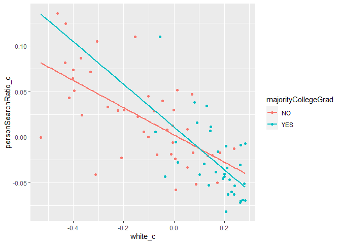

Project 2 - Analyzing and Visualizing Regressions in Minneapolis
Demographics and Police Stop Data
================

## Truman Le ttl662

------------------------------------------------------------------------

### Introduction

For this project, I chose the datasets MplsDemo (Minneapolis Demographic
Data 2015, by Neighborhood) and MplsStops (Minneapolis Police Department
2017 Stop Data) provided by the carData package in R like I did in the
first project. I used all eight variables from MplsDemo, but I primarily
look at ‘neighborhood’ (name of the neighborhood), ‘white’ (fraction of
the population estimated to be white), and ‘collegeGrad’ (estimated
fraction with a college degree). From MplsStops, I only used 5 of the
variables in MplsStops, which are ‘neighborhood’ (same as MplsDemo),
‘problem’ (a factor with levels ‘suspicious’ for suspicious vehicle or
person stops and ‘traffic’ for traffic stops), ‘citationIssued’ (a
factor with levels ‘no’ ‘yes’ indicating if a citation was issued),
‘personSearch’ (a factor with levels ‘no’ ‘yes’ indicating if the
stopped person was searched), and ‘vehicleSearch’ (a factor with levels
no or yes indicating if a vehicle was searched). The four variables that
aren’t neighborhood were tidied to be numeric, I transformed them into
ratios with ‘suspiciousRatio’ (the proportion of suspicious
vehicle/person stops out of all the vehicle/person stops), and
‘citationRatio’, ‘personSearchRatio’, and ‘vehicleSearchRatio’ (the
proportion of getting a citation, person searched, or vehicle searched
out of all the traffic stops). All NA values were omitted to guarantee
complete data. There are a total of 84 observations. I’m interested in
visualizing regressions with the demographics of a city and the data
from police stops in order to determine if there’s a relationship
between possibly racial demographics, demographics of college graduates,
and data such as likelihood a person is searched in the neighborhood. I
think social issues like these are really important in society and
analyzing biases in the police department of Minneapolis is crucial. I
expect to find lower ratios of a person being searched as the population
estimated to be white and the population estimated to have a college
degree increases. I also expect the population estimated to be white to
be correlated with the population estimated to have a college degree.

### Tidy

``` r
library(carData)
library(dplyr)
library(tidyverse)
data(MplsDemo)
data(MplsStops) #All of the following and above is to call data and call necessary packages to complete code.

data1 <- MplsStops %>% #Purpose of this code is to take categorical variable of 'problem' and turn it into numeric variable 'suspiciousRatio'.
  group_by(neighborhood) %>% #Group by neighborhood to make it easier.
  count(problem) %>% #Use count to only have column of neighborhood and new columns of 'problem' and 'n' to count numbers of each of every neighborhood.
  pivot_wider(names_from = problem, values_from = n) %>% #This makes the two types of problems, 'suspicious' and 'traffic' into their own columns and uses n column to fill in values.
  mutate(suspiciousRatio=suspicious/(suspicious+traffic)) #This makes our goal column of 'suspiciousRatio' by taking number of 'suspicious' and divided it by total problems for the neighborhood.

data2 <- MplsStops %>% #Purpose of this code is to take categorical variable of 'citationIssued' and turn it into numeric variable 'citationRatio'.
  group_by(neighborhood) %>% #Group by neighborhood to make it easier.
  count(citationIssued) %>% #Use count to only have column of neighborhood and new columns of 'citationIssued' and 'n' to count numbers of each of every neighborhood.
  pivot_wider(names_from = citationIssued, values_from = n) %>% #This makes the two types of citations issued, 'NO' and 'YES' into their own columns and uses n column to fill in values.
  mutate(citationRatio=YES/(NO+YES)) #This makes our goal column of 'citationRatio' by taking number of 'YES' and divided it by total citations issued for the neighborhood.

data3 <- MplsStops %>% #Purpose of this code is to take categorical variable of 'personSearch' and turn it into numeric variable 'personSearchRatio'.
  group_by(neighborhood) %>% #Group by neighborhood to make it easier.
  count(personSearch) %>% #Use count to only have column of neighborhood and new columns of 'personSearch' and 'n' to count numbers of each of every neighborhood.
  pivot_wider(names_from = personSearch, values_from = n) %>% #This makes the two types of person searched, 'NO' and 'YES' into their own columns and uses n column to fill in values.
  mutate(personSearchRatio=YES/(NO+YES)) #This makes our goal column of 'personSearchRatio' by taking number of 'YES' and divided it by total persons searched for the neighborhood.

data4 <- MplsStops %>% #Purpose of this code is to take categorical variable of 'vehicleSearch' and turn it into numeric variable 'vehicleSearchRatio'.
  group_by(neighborhood) %>% #Group by neighborhood to make it easier.
  count(vehicleSearch) %>% #Use count to only have column of neighborhood and new columns of 'vehicleSearch' and 'n' to count numbers of each of every neighborhood.
  pivot_wider(names_from = vehicleSearch, values_from = n) %>% #This makes the two types of vehicle searched, 'NO' and 'YES' into their own columns and uses n column to fill in values.
  mutate(vehicleSearchRatio=YES/(NO+YES)) #This makes our goal column of 'vehicleSearchRatio' by taking number of 'YES' and divided it by total vehicles searched for the neighborhood.

MplsStopsClean <- bind_cols(data1, data2['citationRatio'],data3['personSearchRatio'],data4['vehicleSearchRatio']) %>% #This makes new dataset that adds the ratio columns of the last 3 datasets made to the first dataset made with 'suspiciousRatio'.
  select(-suspicious,-traffic) #This removes the categorical variables of 'suspicious' and 'traffic'.

data <- MplsDemo %>%
  right_join(MplsStopsClean,by="neighborhood") %>% #Use right join because we want to add the variables from MplsDemo to our new clean dataset. The new clean dataset has the main variables we want to study, so we want all of MplsDemo on there to examine all associations.
mutate(majorityWhite = case_when(white>0.5 ~ "YES", white<0.5 ~ "NO"),majorityCollegeGrad = case_when(collegeGrad>0.5 ~ "YES", collegeGrad<0.5 ~ "NO")) %>% #This creates a new variable called 'majorityWhite' to label neighborhoods that have a population of white people over than 50%, as well as for majority of population with a college degree. I plan to use this mostly to examine associations with the ratios, it seems the most effective way to explore discrimination.
  na.omit() #This removes all NA values.
```

### EDA

``` r
#Make data frame only numeric variables
data_num <- data %>%
  select_if(is.numeric)

#Make correlation matrix with univariate and bivariate graphs and correlation coefficients
library(psych)
pairs.panels(data_num, 
             method = "pearson", # correlation coefficient method
             hist.col = "blue", # color of histogram 
             smooth = FALSE, density = FALSE, ellipses = FALSE)
```


``` r
grouped_mean_data <- data %>% #Format for the lines below is same as this. Create new dataset that collects the means (or other summary statistics) of the ratios while grouped by if the neighborhood has a white-dominant population.
  group_by(majorityWhite) %>%
  summarize(mean(suspiciousRatio),mean(citationRatio),mean(personSearchRatio),mean(vehicleSearchRatio))
grouped_sd_data <- data %>%
  group_by(majorityWhite) %>%
  summarize(sd(suspiciousRatio),sd(citationRatio),sd(personSearchRatio),sd(vehicleSearchRatio))
grouped_IQR_data <- data %>%
  group_by(majorityWhite) %>%
  summarize(IQR(suspiciousRatio),IQR(citationRatio),IQR(personSearchRatio),IQR(vehicleSearchRatio))
grouped_median_data <- data %>%
  group_by(majorityWhite) %>%
  summarize(median(suspiciousRatio),median(citationRatio),median(personSearchRatio),median(vehicleSearchRatio))

Category <- c("Suspicious Ratio (Non-White)","Suspicious Ratio (White)", "Citation Ratio (Non-White)", "Citation Ratio (White)", "Person Search Ratio (Non-White)","Person Search Ratio (White)","Vehicle Search Ratio (Non-White)","Vehicle Search Ratio (White)") #This and the rest of the lines below makes columns for new data that we'll use to make a nice table to display summary statistics grouped by if the neighborhood is white-dominant or not.
Mean <- c(grouped_mean_data$`mean(suspiciousRatio)`, grouped_mean_data$`mean(citationRatio)`, grouped_mean_data$`mean(personSearchRatio)`,grouped_mean_data$`mean(vehicleSearchRatio)`)
SD <- c(grouped_sd_data$`sd(suspiciousRatio)`, grouped_sd_data$`sd(citationRatio)`, grouped_sd_data$`sd(personSearchRatio)`,grouped_sd_data$`sd(vehicleSearchRatio)`)
IQR <- c(grouped_IQR_data$`IQR(suspiciousRatio)`, grouped_IQR_data$`IQR(citationRatio)`, grouped_IQR_data$`IQR(personSearchRatio)`,grouped_IQR_data$`IQR(vehicleSearchRatio)`)
Med <- c(grouped_median_data$`median(suspiciousRatio)`, grouped_median_data$`median(citationRatio)`, grouped_median_data$`median(personSearchRatio)`,grouped_median_data$`median(vehicleSearchRatio)`)

library(kableExtra)
grouped_table <- data.frame(Category, Mean,SD,IQR,Med) #This combines the columns above to make a new dataset, and it's transformed into the data frame called 'grouped_table'.
grouped_table[,-1] <- round(grouped_table[,-1],4) #This rounds the values to 4 decimal points.
kbl(grouped_table, booktabs = T,caption = "Summary Statistics of Ratios Grouped by White and Non-White Dominant Neighborhoods") %>% #This and the line below makes the table nice and labels the table.
kable_styling(latex_options = "striped")
```

<table class="table" style="margin-left: auto; margin-right: auto;">
<caption>
Summary Statistics of Ratios Grouped by White and Non-White Dominant
Neighborhoods
</caption>
<thead>
<tr>
<th style="text-align:left;">
Category
</th>
<th style="text-align:right;">
Mean
</th>
<th style="text-align:right;">
SD
</th>
<th style="text-align:right;">
IQR
</th>
<th style="text-align:right;">
Med
</th>
</tr>
</thead>
<tbody>
<tr>
<td style="text-align:left;">
Suspicious Ratio (Non-White)
</td>
<td style="text-align:right;">
0.5939
</td>
<td style="text-align:right;">
0.1593
</td>
<td style="text-align:right;">
0.2684
</td>
<td style="text-align:right;">
0.6229
</td>
</tr>
<tr>
<td style="text-align:left;">
Suspicious Ratio (White)
</td>
<td style="text-align:right;">
0.5112
</td>
<td style="text-align:right;">
0.2173
</td>
<td style="text-align:right;">
0.3968
</td>
<td style="text-align:right;">
0.4530
</td>
</tr>
<tr>
<td style="text-align:left;">
Citation Ratio (Non-White)
</td>
<td style="text-align:right;">
0.1227
</td>
<td style="text-align:right;">
0.0487
</td>
<td style="text-align:right;">
0.0512
</td>
<td style="text-align:right;">
0.1191
</td>
</tr>
<tr>
<td style="text-align:left;">
Citation Ratio (White)
</td>
<td style="text-align:right;">
0.1548
</td>
<td style="text-align:right;">
0.1018
</td>
<td style="text-align:right;">
0.1364
</td>
<td style="text-align:right;">
0.1421
</td>
</tr>
<tr>
<td style="text-align:left;">
Person Search Ratio (Non-White)
</td>
<td style="text-align:right;">
0.1425
</td>
<td style="text-align:right;">
0.0480
</td>
<td style="text-align:right;">
0.0591
</td>
<td style="text-align:right;">
0.1381
</td>
</tr>
<tr>
<td style="text-align:left;">
Person Search Ratio (White)
</td>
<td style="text-align:right;">
0.0731
</td>
<td style="text-align:right;">
0.0384
</td>
<td style="text-align:right;">
0.0538
</td>
<td style="text-align:right;">
0.0716
</td>
</tr>
<tr>
<td style="text-align:left;">
Vehicle Search Ratio (Non-White)
</td>
<td style="text-align:right;">
0.0908
</td>
<td style="text-align:right;">
0.0375
</td>
<td style="text-align:right;">
0.0508
</td>
<td style="text-align:right;">
0.0809
</td>
</tr>
<tr>
<td style="text-align:left;">
Vehicle Search Ratio (White)
</td>
<td style="text-align:right;">
0.0453
</td>
<td style="text-align:right;">
0.0267
</td>
<td style="text-align:right;">
0.0353
</td>
<td style="text-align:right;">
0.0401
</td>
</tr>
</tbody>
</table>

### EDA - Discussion

We can see some strong correlation coefficients between variables that
we want to exam. For example, there’s a strong positive correlation
coefficient for white and collegeGrad (0.88), which indicates,
generally, as the white population increases, the population with
college degrees also increases. We can also see a strong negative
correlation between person search ratio and white (-0.73). This means
that generally as the white population increases, the ratio of persons
being searched decreases. The correlation between collegeGrad and
personSeachRatio is also moderately strong, but not as strong as the
correlation between white and personSearchRatio. With the summary
statistics, we can conclude that the person search ratio of non-white
neighborhoods seems to be significantly higher than that of white
neighborhoods, with a mean twice that of white neighborhoods, and our
strong correlation coefficient helps support the likelihood of
significant results. A small standard deviation also means our results
are unlikely to stray too far from the truth.

### MANOVA

``` r
# Perform MANOVA with 4 response variables listed in cbind()
manova_data <- manova(cbind(suspiciousRatio,citationRatio,personSearchRatio,vehicleSearchRatio) ~ majorityWhite, data = data)

# Output of MANOVA
summary(manova_data)
```

    ##               Df Pillai approx F num Df den Df    Pr(>F)    
    ## majorityWhite  1 0.4528   14.895      4     72 6.475e-09 ***
    ## Residuals     75                                            
    ## ---
    ## Signif. codes:  0 '***' 0.001 '**' 0.01 '*' 0.05 '.' 0.1 ' ' 1

``` r
  # Since MANOVA is significant then we can perform one-way ANOVA for each variable
  summary.aov(manova_data)
```

    ##  Response suspiciousRatio :
    ##               Df Sum Sq Mean Sq F value Pr(>F)
    ## majorityWhite  1 0.1012 0.10119  2.4273 0.1234
    ## Residuals     75 3.1267 0.04169               
    ## 
    ##  Response citationRatio :
    ##               Df  Sum Sq   Mean Sq F value Pr(>F)
    ## majorityWhite  1 0.01521 0.0152066  1.8228  0.181
    ## Residuals     75 0.62568 0.0083425               
    ## 
    ##  Response personSearchRatio :
    ##               Df   Sum Sq  Mean Sq F value    Pr(>F)    
    ## majorityWhite  1 0.071278 0.071278  42.226 7.972e-09 ***
    ## Residuals     75 0.126602 0.001688                      
    ## ---
    ## Signif. codes:  0 '***' 0.001 '**' 0.01 '*' 0.05 '.' 0.1 ' ' 1
    ## 
    ##  Response vehicleSearchRatio :
    ##               Df   Sum Sq   Mean Sq F value    Pr(>F)    
    ## majorityWhite  1 0.030669 0.0306686  34.502 1.093e-07 ***
    ## Residuals     75 0.066666 0.0008889                      
    ## ---
    ## Signif. codes:  0 '***' 0.001 '**' 0.01 '*' 0.05 '.' 0.1 ' ' 1

``` r
    # Since ANOVA is significant for personSearchRatio and vehicleSearchRatio, then we can perform post-hoc analysis
    # For person search ratio
    pairwise.t.test(data$personSearchRatio,data$majorityWhite, p.adj="none")
```

    ## 
    ##  Pairwise comparisons using t tests with pooled SD 
    ## 
    ## data:  data$personSearchRatio and data$majorityWhite 
    ## 
    ##     NO   
    ## YES 8e-09
    ## 
    ## P value adjustment method: none

``` r
    # For vehicle search ratio
    pairwise.t.test(data$vehicleSearchRatio,data$majorityWhite, p.adj="none")
```

    ## 
    ##  Pairwise comparisons using t tests with pooled SD 
    ## 
    ## data:  data$vehicleSearchRatio and data$majorityWhite 
    ## 
    ##     NO     
    ## YES 1.1e-07
    ## 
    ## P value adjustment method: none

``` r
#Calculate the probability of having at least 1 type 1 error    
prob <- 1 - 0.95^7
prob
```

    ## [1] 0.3016627

``` r
#Calculate bonferroni cofficient by dividing 0.05 by number of tests (1 MANOVA + 4 ANOVA + 2 POST HOC)
bonf <- 0.05/7
bonf
```

    ## [1] 0.007142857

``` r
#Adjust for bonferroni
pairwise.t.test(data$personSearchRatio,data$majorityWhite, p.adj="bonferroni")
```

    ## 
    ##  Pairwise comparisons using t tests with pooled SD 
    ## 
    ## data:  data$personSearchRatio and data$majorityWhite 
    ## 
    ##     NO   
    ## YES 8e-09
    ## 
    ## P value adjustment method: bonferroni

``` r
pairwise.t.test(data$vehicleSearchRatio,data$majorityWhite, p.adj="bonferroni")
```

    ## 
    ##  Pairwise comparisons using t tests with pooled SD 
    ## 
    ## data:  data$vehicleSearchRatio and data$majorityWhite 
    ## 
    ##     NO     
    ## YES 1.1e-07
    ## 
    ## P value adjustment method: bonferroni

### Manova Discussion

The MANOVA test was significant with a p-value of 6.475e-9, so we
perform a one-way ANOVA for each variable. After doing this, only two
response variables are significant: personSearchRatio (p-value of
7.972e-9) and vehicleSearchRatio (p-value of 1.093e-7), which means
there’s a mean difference of these ratios across neighborhoods that are
majority white and not majority white. Post-hoc tests were conducted,
but they’re not very helpful since there are only two groups, being
majority white or not. I conducted a total of 7 tests: 1 MANOVA, 4 ANOVA
tests for each variable, and 2 post-hoc tests for the 2 significant
response variables. The probability of getting at least one type 1 error
is (1 - 0.95^7) which is 0.3016627. The bonferroni coefficient is
gathered by dividing 0.05 by the number of tests, which is 0.007142857.
Both responses remain significant after the correction. For assumptions,
this is a random sample and observations are independent. The sample is
large enough, so multivariate normality is most likely met. Homogeneity
is most likely met but further tests would have to be conducted to
verify. Linear relationships is likely met because of the correlation
coefficientes, and there aren’t any extremely outliers.

### Randomization Test

``` r
#Conduct randomization test
Fs <- replicate(5000,{
  # Randomly permute the response variable across majority white neighborhoods
  data_new <- data %>%
    mutate(personSearchRatio = sample(personSearchRatio))
  # Compute variation within groups
  SSW <- data_new %>%
    group_by(majorityWhite) %>%
    summarize(SSW = sum((personSearchRatio - mean(personSearchRatio))^2)) %>%
    summarize(sum(SSW)) %>% 
    pull
  # Compute variation between groups
  SSB <- data_new %>% 
    mutate(mean = mean(personSearchRatio)) %>%
    group_by(majorityWhite) %>% 
    mutate(groupmean = mean(personSearchRatio)) %>%
    summarize(SSB = sum((mean - groupmean)^2)) %>%
    summarize(sum(SSB)) %>%
    pull
  # Compute the F-statistic (ratio of MSB and MSW)
  # df for SSB is 2 groups - 1 = 1
  # df for SSW is 84 observations - 2 groups = 82
  (SSB/1)/(SSW/82)
})

# Represent the distribution of the F-statistics for each randomized sample
hist(Fs, prob=T); abline(v = 42.226, col="red",add=T)
```


``` r
# Calculate the proportion of F statistic that are greater than the observed F-statistic
mean(Fs > 42.226)
```

    ## [1] 0

### Randomization Test - Discussion

The null hypothesis is that the two groups of majority white and
majority non-white have equal means for personSearchRatio, while the
alternative hypothesis is that these two groups don’t have equal means
for personSearchRatio. After performing the test and seeing that the
proportion of F statistic that’s greater than the observed F statistic
is 0, we can reject the null hypothesis and conclude that the these two
groups don’t have equal means for personSearchRatio. A plot is made
representing the distribution of F statistic for the randomized samples
under null distribution.

### Linear regression model

``` r
#Call these for testing assumptions later
library(sandwich)
library(lmtest)

# Center the data around the means (the intercept becomes more informative)
data$personSearchRatio_c <- data$personSearchRatio - mean(data$personSearchRatio)
data$white_c <- data$white - mean(data$white)

# Include an interaction term in the regression model with centered predictors. White is used as numeric explanatory variable here so interaction term makes more sense.
fit_c <- lm(personSearchRatio_c ~ white_c * majorityCollegeGrad, data = data)
summary(fit_c)
```

    ## 
    ## Call:
    ## lm(formula = personSearchRatio_c ~ white_c * majorityCollegeGrad, 
    ##     data = data)
    ## 
    ## Residuals:
    ##      Min       1Q   Median       3Q      Max 
    ## -0.09005 -0.02159 -0.00655  0.02075  0.08585 
    ## 
    ## Coefficients:
    ##                                 Estimate Std. Error t value Pr(>|t|)    
    ## (Intercept)                     0.002402   0.006402   0.375    0.709    
    ## white_c                        -0.149272   0.026153  -5.708 2.31e-07 ***
    ## majorityCollegeGradYES          0.008703   0.013477   0.646    0.520    
    ## white_c:majorityCollegeGradYES -0.084695   0.066411  -1.275    0.206    
    ## ---
    ## Signif. codes:  0 '***' 0.001 '**' 0.01 '*' 0.05 '.' 0.1 ' ' 1
    ## 
    ## Residual standard error: 0.03535 on 73 degrees of freedom
    ## Multiple R-squared:  0.539,  Adjusted R-squared:  0.5201 
    ## F-statistic: 28.46 on 3 and 73 DF,  p-value: 2.706e-12

``` r
# Visualize the relationships between the three variables
ggplot(data, aes(x = white_c, y = personSearchRatio_c, color = majorityCollegeGrad)) +
  geom_point() +
  geom_smooth(method=lm, se=FALSE, fullrange=TRUE)
```



``` r
# Find proportion of variation the model explains
summary(fit_c)$r.sq
```

    ## [1] 0.5390402

``` r
# Linearity and homoscedasticity
plot(fit_c, which = 1)
```


``` r
bptest(fit_c)
```

    ## 
    ##  studentized Breusch-Pagan test
    ## 
    ## data:  fit_c
    ## BP = 11.425, df = 3, p-value = 0.009634

``` r
# Normality
plot(fit_c, which = 2)
```


``` r
shapiro.test(fit_c$residuals)
```

    ## 
    ##  Shapiro-Wilk normality test
    ## 
    ## data:  fit_c$residuals
    ## W = 0.98208, p-value = 0.3506

``` r
# Robust Standard Errors
coeftest(fit_c, vcov = vcovHC(fit_c))
```

    ## 
    ## t test of coefficients:
    ## 
    ##                                  Estimate Std. Error t value  Pr(>|t|)    
    ## (Intercept)                     0.0024018  0.0055792  0.4305    0.6681    
    ## white_c                        -0.1492724  0.0321978 -4.6361 1.519e-05 ***
    ## majorityCollegeGradYES          0.0087025  0.0203367  0.4279    0.6700    
    ## white_c:majorityCollegeGradYES -0.0846953  0.0983581 -0.8611    0.3920    
    ## ---
    ## Signif. codes:  0 '***' 0.001 '**' 0.01 '*' 0.05 '.' 0.1 ' ' 1

``` r
# Estimating coefficients SEs
# Use the function replicate to repeat the process (similar to a for loop)
samp_SEs <- replicate(5000, {
  # Bootstrap your data (resample observations)
  boot_data <- sample_frac(data, replace = TRUE)
  # Fit regression model
  fitboot <- lm(personSearchRatio ~ white * majorityCollegeGrad, data = boot_data)
  # Save the coefficients
  coef(fitboot)
})

# Estimated SEs
samp_SEs %>%
  # Transpose the obtained matrices
  t %>%
  # Consider the matrix as a data frame
  as.data.frame %>%
  # Compute the standard error (standard deviation of the sampling distribution)
  summarize_all(sd)
```

    ##   (Intercept)      white majorityCollegeGradYES white:majorityCollegeGradYES
    ## 1  0.01733531 0.02963006             0.06821355                   0.08539617

### Linear regression model - Discussion

I am trying to predict person search ratio from population estimated to
be white and whether the neighborhood has a majority of population has a
college degree or not. All numeric variables are mean-centered, and a
graph is made to visualize the relationships. Controlling for the
population estimated to be white and assuming the neighborhood doesn’t
have a majority of population with a college degree, the person search
ratio increases by 0.002402 on average. Assuming the neighborhood
doesn’t have a majority of population with a college degree, the person
search ratio decreases by 0.149272 on average for every 1 unit increase
in white population. Controlling for the population estimated to be
white, the person search ratio of neighborhoods with a majority
population with college degrees is expected to be 0.008703 higher than
neighborhoods without a majority population with college degrees, on
average. The expected person search ratio of neighborhoods with a
majority population with college degrees is 0.084695 lower than that of
neighborhoods with a majority population without college degrees. The
model explains 53.90402% of the variation in the response. All
assumptions are checked and are met fairly well. After computing with
robust standard errors, only the white\_c response was significant with
a p-value of 1.519e-5. With the exception of the intercept (whose
standard error is a little bit bigger than that of the robust standard
error), the robust standard errors are all bigger than their original
respective standard errors. We can see a little bit of similar results
with our boostrapped standard errors. For intercept and
majorityCollegeGradYES, the standard error is significantly larger in
the boostrapped standard errors compared to the other two, but for
white\_c and the interaction term, there isn’t that much of a
significant difference.

### Logistic Regression

``` r
# Create a binary variable coded as 0 and 1
data <- data %>%
  mutate(y = ifelse(majorityWhite == "YES", 1, 0))

# Fit a logistic regression model
fit2 <- glm(y ~ personSearchRatio + collegeGrad,  data = data, family = "binomial")
summary(fit2)
```

    ## 
    ## Call:
    ## glm(formula = y ~ personSearchRatio + collegeGrad, family = "binomial", 
    ##     data = data)
    ## 
    ## Deviance Residuals: 
    ##      Min        1Q    Median        3Q       Max  
    ## -1.75074   0.00000   0.00000   0.00024   1.37994  
    ## 
    ## Coefficients:
    ##                   Estimate Std. Error z value Pr(>|z|)
    ## (Intercept)         -26.18      17.83  -1.469    0.142
    ## personSearchRatio   -67.77      42.81  -1.583    0.113
    ## collegeGrad         103.44      64.20   1.611    0.107
    ## 
    ## (Dispersion parameter for binomial family taken to be 1)
    ## 
    ##     Null deviance: 88.2089  on 76  degrees of freedom
    ## Residual deviance:  6.5996  on 74  degrees of freedom
    ## AIC: 12.6
    ## 
    ## Number of Fisher Scoring iterations: 11

``` r
# Interpret the coefficients by considering the odds (inverse of log(odds))
exp(coef(fit2))
```

    ##       (Intercept) personSearchRatio       collegeGrad 
    ##      4.248661e-12      3.712050e-30      8.380302e+44

``` r
# Add predicted probabilities to the dataset
data$prob <- predict(fit2, type = "response")

# Predicted outcome is based on the probability of malignant
# if the probability is greater than 0.5, the clump is found to be malignant
data$predicted <- ifelse(data$prob > .5, "YES", "NO") 

#Confusion matrix
table(truth = data$majorityWhite, prediction = data$predicted)
```

    ##      prediction
    ## truth NO YES
    ##   NO  19   1
    ##   YES  1  56

``` r
# Accuracy (correctly classified cases)
(19 + 56)/77 
```

    ## [1] 0.974026

``` r
# Sensitivity (True Positive Rate, TPR)
56/57
```

    ## [1] 0.9824561

``` r
# Specificity (True Negative Rate, TNR)
19/20 
```

    ## [1] 0.95

``` r
# Precision (Positive Predictive Value, PPV)
56/57
```

    ## [1] 0.9824561

``` r
# Save the predicted log-odds in the dataset
data$logit <- predict(fit2)

# Compare to the outcome in the dataset with a density plot
ggplot(data, aes(logit, fill = as.factor(majorityWhite))) +
  geom_density(alpha = .3) +
  geom_vline(xintercept = 0, lty = 2) +
  labs(fill = "YES")
```


``` r
# Base predicted probabilities
data$prob1 <- predict(fit2, type = "response")

#Call to make ROC plot
library(plotROC) 

# Plot ROC depending on values of y and its probabilities
ROCplot1 <- ggplot(data) + 
  geom_roc(aes(d = y, m = prob1), n.cuts = 0)
ROCplot1
```


``` r
#Calculate AUC
calc_auc(ROCplot1)
```

    ##   PANEL group       AUC
    ## 1     1    -1 0.9991228

### Logistic Regression - Discussion

I’m trying to predict the binary categorical variable majorityWhite from
personSearchRatio and collegeGrad (numeric variables). Controlling for
collegeGrad, for every 1-unit increase in personSearchRatio, the odds of
a neighborhood being majority white change by a factor of 3.712050e-30.
Controlling for personSearchRatio, for every 1-unit increase in
collegeGrad, the odds of a neighborhood being majority white change by a
factor of 8.380302e+44. The table for the confusion matrix is made. All
values (Accuracy, Sensitivity (TPR), Specificity (TNR), and Recall
(PPV)) are extremely high (over 0.95) which means the model is very
accurate and good. A graph to plot density of log-odds (logit) by the
binary outcome variable is made. An ROC curve is made and AUC is
calculated to be 0.9991228, which means a randomly selected neighborhood
that’s majority white has a test value larger than for a randomly chosen
neighborhood that isn’t majority white 99.91228 percent of the time.
This would be considered an excellent model.

Note that the `echo = FALSE` parameter was added to the code chunk to
prevent printing of the R code that generated the plot.
